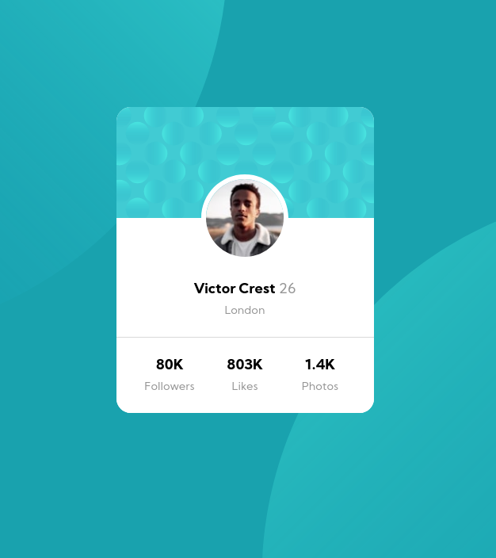

# Frontend Mentor - Profile card component solution

This is a solution to the [Profile card component challenge on Frontend Mentor](https://www.frontendmentor.io/challenges/profile-card-component-cfArpWshJ).

## Table of contents

- [Overview](#overview)
  - [The challenge](#the-challenge)
  - [Screenshot](#screenshot)
  - [Links](#links)
- [My process](#my-process)
  - [Built with](#built-with)
  - [What I learned](#what-i-learned)
- [Author](#author)

## Overview

### The challenge

- Build out the project to the designs provided

### Screenshot



### Links

- [Solution URL](git@github.com:huynhlv54/fm-personal-info-card.git)
- [Live Site URL](https://huynhlv54.github.io/fm-personal-info-card)

## My process

### Built with
- Flexbox

### What I learned

- Setting background position

```css
body {
    background:
        url("images/bg-pattern-top.svg") calc(50% - 510px) calc(50% - 390px) no-repeat,
        url('./images/bg-pattern-bottom.svg') calc(50% + 510px) calc(50% + 400px) no-repeat
           var(--dark-cyan);
}

.profile-image > img {
    width: 110px;
    height: 110px;
    margin: 0 auto; /* Center the image */
    border: 6px solid white;

    /* Put the image between 2 divs*/
    position: absolute;
    transform: translate(-50%, -50%); /* */

    /* Round the image */
    border-radius: 50%;
}

```

## Author
- Frontend Mentor - [@huynhlv54](https://www.frontendmentor.io/profile/huynhlv54)
